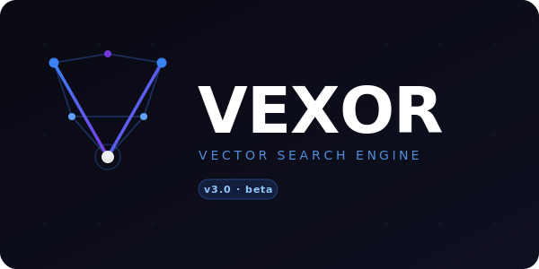

<div align="center">



# Vexor

**Advanced vector similarity search engine built on [Qdrant](https://qdrant.tech/)**

[](https://www.python.org/)
[](LICENSE)
[](https://github.com/Sangaibisi/vexor)
[](https://github.com/Sangaibisi/vexor)
[](https://github.com/astral-sh/ruff)
[](https://github.com/astral-sh/uv)
[](https://qdrant.tech/)

</div>

---

## Features

| | Feature | Description |
|---|---|---|
| 🔍 | **Hybrid Search** | Dense + sparse embeddings with reciprocal rank fusion |
| 📥 | **Multi-source Ingestion** | Tabular data (CSV/Delta), PDF files, AWS S3 |
| 🤖 | **Agent-enhanced Search** | CrewAI and LangChain ReAct agents |
| 🧠 | **Flexible Embeddings** | FastEmbed and Sentence Transformers |
| 💬 | **LLM Integration** | OpenAI and Google Gemini |
| 📊 | **Observability** | AgentOps, Opik, Langfuse |
| 🎛️ | **Advanced Filtering** | Full-text, keyword, range, and boolean filters |
| ⚡ | **Sharding & Quantization** | Enterprise-scale vector operations |

## Requirements

- Python `>= 3.11`
- [uv](https://docs.astral.sh/uv/) package manager
- Qdrant instance (local or cloud)

## Installation

```bash
uv sync                              # core
uv sync --extra crewai               # CrewAI agents
uv sync --extra langchain            # LangChain agents
uv sync --extra agentops             # AgentOps tracing
uv sync --extra opik                 # Opik tracing
uv sync --extra langfuse             # Langfuse tracing
uv sync --extra dev                  # development tools
```

## Quick Start

### Ingest Data

```python
from vexor import VexorSession, IngestionPipeline
from vexor.config import (
    VexorSettings, CollectionSpec, ServerConnectionSpec,
    EmbeddingSpec, DenseModelSpec, IngestionSpec, LogSpec,
)

settings = VexorSettings(
    collection=CollectionSpec(name="movies"),
    server=ServerConnectionSpec(host="localhost", port=6333),
    embedding=EmbeddingSpec(dense=DenseModelSpec()),
    ingestion=IngestionSpec(data_dir="./data"),
    log=LogSpec(enabled=True),
)

session = VexorSession(settings)
pipeline = IngestionPipeline(
    session,
    columns=["title", "overview"],
    payloads=["title", "director"],
)
pipeline.run()
session.close()
```

### Search

```python
from vexor import VexorSession, SearchEngine
from vexor.config import SingleQuery, SearchParams, FilterSpec

session = VexorSession(settings)
engine = SearchEngine(session)

results = engine.search(
    query=SingleQuery(text="space adventure"),
    params=SearchParams(
        collection="movies",
        filter=FilterSpec(must_not={"director": "Michael Bay"}),
        limit=5,
    ),
)
session.close()
```

### Recommend

```python
from vexor.search import Recommender
from vexor.config import RecommendQuery, RecommendParams

recommender = Recommender(session, embedder)
results = recommender.find_similar(
    query=RecommendQuery(positive=["point-id-1"]),
    params=RecommendParams(collection="movies", limit=5),
)
```

### Run Examples

```bash
uv run vexor.examples.ingest_tabular
uv run vexor.examples.search_dense
```

## Project Structure

```
vexor/
├── config/          # Pydantic configuration specs
├── core/            # Session, collection, shard management
├── embedding/       # Embedder protocol + adapters
├── ingestion/       # Data readers + pipeline
├── search/          # Search engine + recommender
├── agents/          # CrewAI and ReAct agents
├── storage/         # S3, DuckDB connectors
├── llm/             # LLM client + tracing factories
├── segmentation/    # Text chunker factory
├── observability/   # Logging setup
└── examples/        # Usage examples
```

## Development

```bash
uv sync --extra dev   # install dev dependencies
ruff check vexor/     # lint
mypy vexor/           # type check
```

## License

This project is licensed under the **MIT License** — see the [LICENSE](LICENSE) file for details.

Copyright © 2026 [Emrullah YILDIRIM](https://github.com/Sangaibisi)
